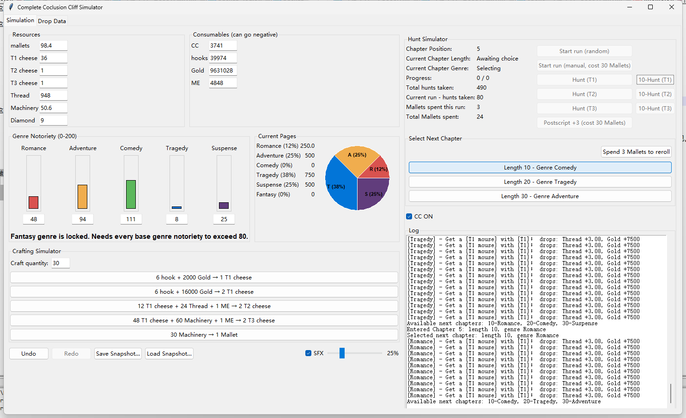

# Complete Coclusion Cliff Simulator



A Tkinter-based tool that fully simulates the Conclusion Cliff gameplay loop, helping hunters plan optimal strategies and visualize every resource change.

## Features
- Accurate tracking of resources/consumables gained or spent.
- Fully customizable enemy drop tables (per enemy, per loot item).
- Import/export your run snapshots (JSON) to resume later.
- Five crafting recipes with batch execution support.
- One-click "10-Hunt" buttons to fast-forward hunts in chapters or Postscript.
- Fancy UI: colored notoriety bars, pages pie chart, live status indicators.
- Undo/Redo, action log, and optional button sound effects with volume control.

### Downloads & Running
- Grab the pre-built `.exe` from the Releases page on the right side of this GitHub repo.
- When sharing the packaged version, copy the entire `dist/CCSimulator/` folder (not just the `.exe`). If you prefer a single-file build, run PyInstaller with `--onefile`.
- Build or run it yourself:
  ```bash
  pip install pyinstaller
  pyinstaller --name "CCSimulator" --noconsole --add-data "sounds;sounds" main.py
  # or
  pyinstaller --onefile --noconsole --add-data "sounds;sounds" main.py
  ```
  The resulting executable (inside `dist/CCSimulator/`) will include the sound files so SFX work out of the box.
- Alternatively, just open the project in PyCharm (or any Python 3.10+ environment) and run `main.py` directly.

## Quick Start
1. **Initial setup**
   - Enter your current resource counts, consumables, and notoriety values on the left.
   - If you have updated drop stats (e.g., from MHCT), open the “Drop Data” tab and edit each mouse’s loot table.
2. **Run the simulator**
   - Back on the “Simulation” tab, use the Hunt buttons (T1/T2/T3 or 10-hunt variants) to advance chapters.
   - CC mode is enabled by default (toggle near the log area) and deducts CC per hunt.
   - Save snapshots whenever you finish configuring a scenario so you can reload it later.
3. **Extras**
   - SFX toggle + volume slider (beside Load Snapshot) controls button sounds.
   - Mallet spending (per run and lifetime) is tracked in the Hunt info panel.
   - Postscript extension (cost 30 Mallets) can be used once per Postscript entry.

Enjoy planning your Conclusion Cliff strategies!
